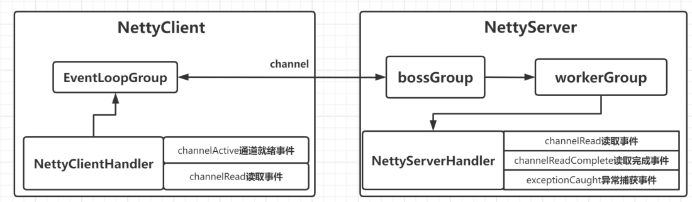

# demo1

## 目标

使用 Netty 开发一个网络应用程序，实现服务端和客户端之间的数据通信。

## 实现步骤

1. 导入依赖坐标
2. 编写Netty服务端程序：配置线程组，配置自定义业务处理类，绑定端口号，然后启动Server，等待Client连接
3. 编写服务端-业务处理类Handler：继承 ChannelInboundHandlerAdapter，并分别重写了三个方法
	- 读取事件
	- 读取完成事件
	- 异常捕获事件
4. 编写客户端程序：配置了线程组，配置了自定义的业务处理类，然后启动Client，连接Server
5. 编写客户端-业务处理类：继承 ChannelInboundHandlerAdapter ，并分别重写了2个方法
	- 通道就绪事件
	- 读取事件
